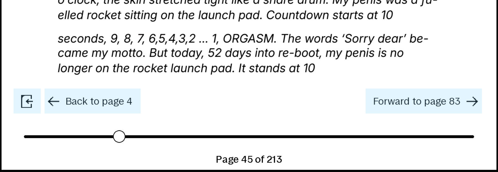
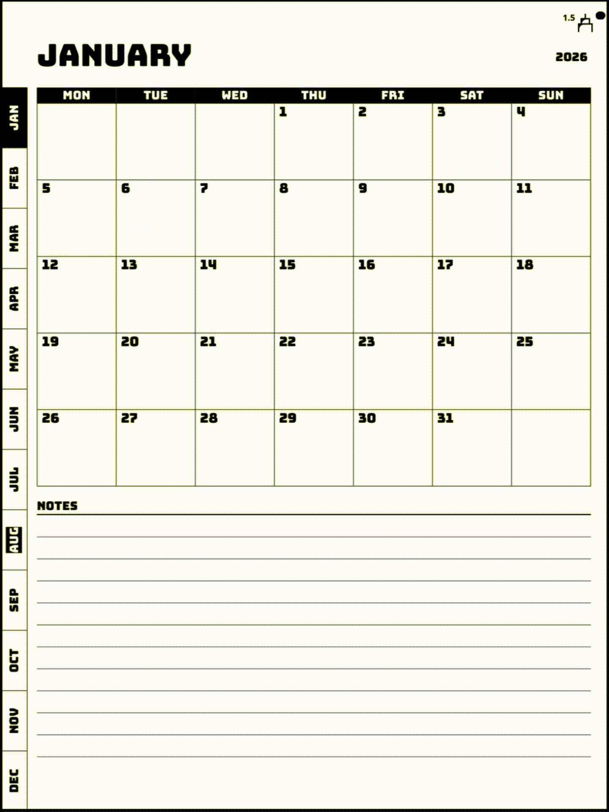
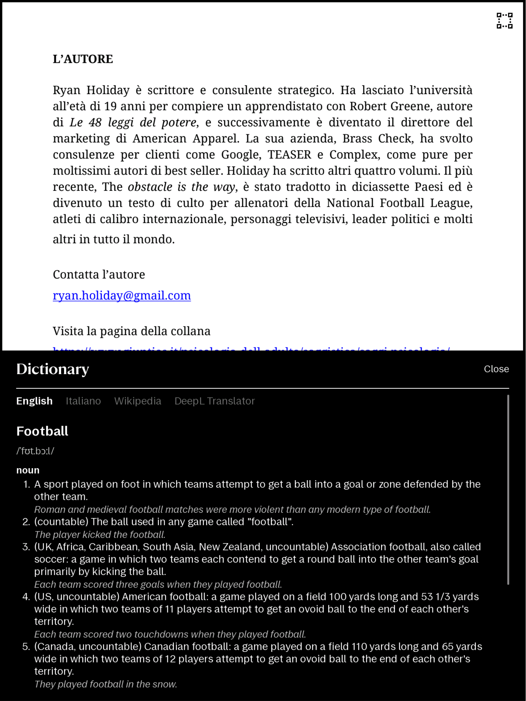
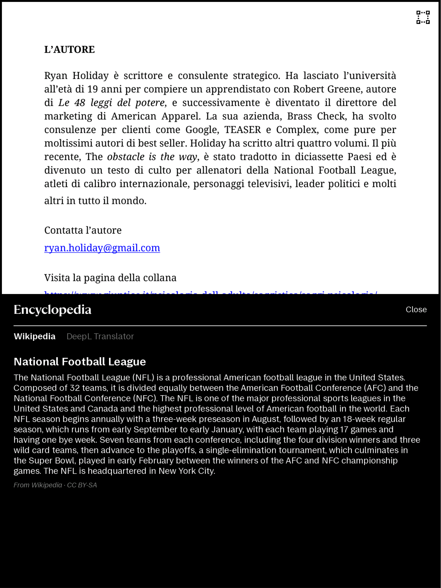
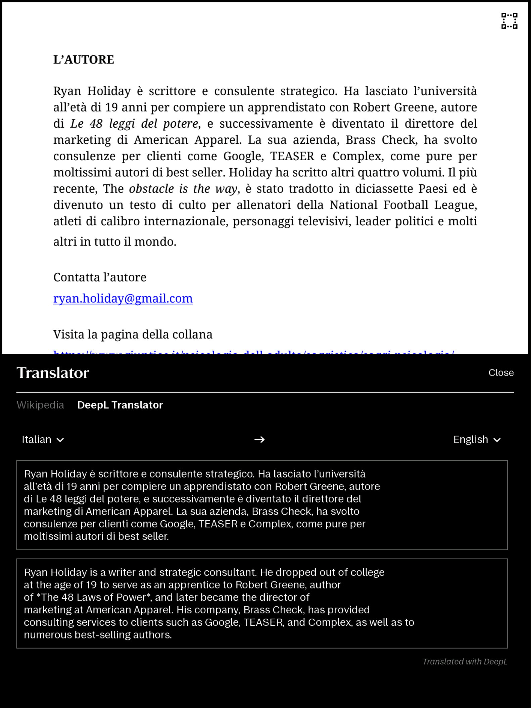
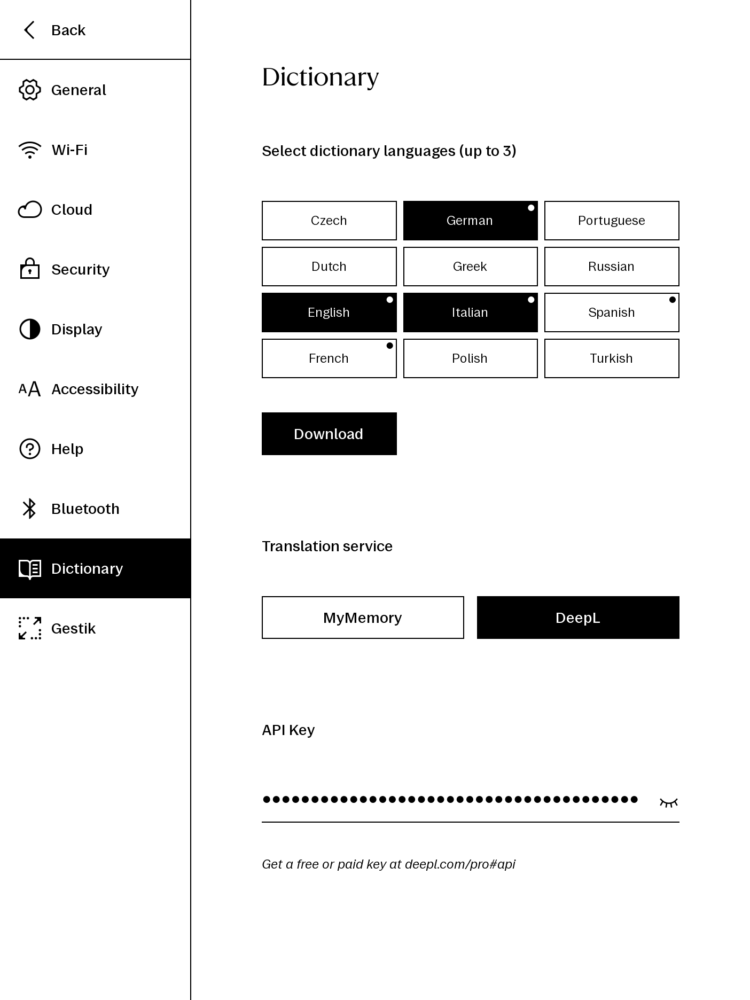
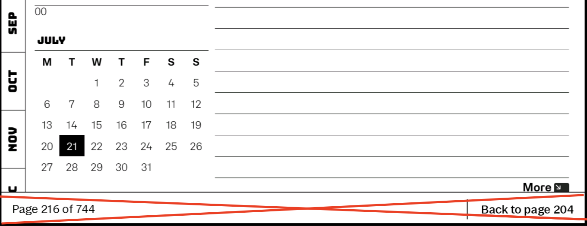
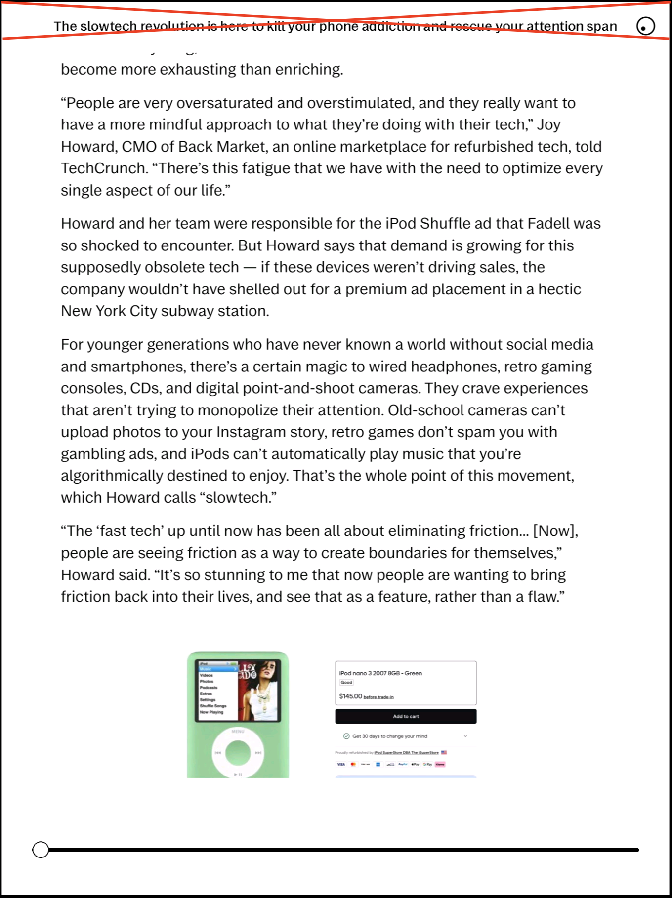
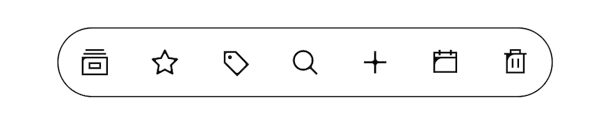

# Extensiones XOVI para reMarkable

Una suite personal de extensiones `.qmd` personalizadas para [XOVI](https://github.com/asivery/xovi) que mejoran el flujo de trabajo de la tableta reMarkable, refinando la interfaz de usuario y desbloqueando funciones esenciales que faltan.

En su núcleo: 
- **[Gestik](#gestik)** — gestos de tres, cuatro y cinco dedos para cambiar instantáneamente las herramientas de escritura / navegar al resumen de páginas / Tabla de Contenidos y más, sin necesidad de tocar la barra de herramientas. Configurable desde: la página *Configuración ▸ Gestik*.
- **[LinkFromSelection](#linkfromselection)** — *enlaces* desde una selección: saltar a una página en el mismo documento o en otro.
- **[NavHistory](#navhistory)** — navegación *Atrás y Adelante* a través del historial de páginas visitadas.
- [**dictionaryWikiTranslator.qmd**](#dictionary) – Capacidades integradas de diccionario, Wikipedia y traducción para PDF y EPUB.
- **Nueve ajustes adicionales** — consulte la [tabla de extensiones](#available-extensions) a continuación.

Probado solo para la última versión de reMarkable OS *xochitl 3.27.2.2* (rM Paper Pure).

## Instalación

Requiere una reMarkable en modo de desarrollador ejecutando [XOVI](https://github.com/asivery/xovi) y
[qt-resource-rebuilder](https://github.com/asivery/rm-xovi-extensions/tree/master/qt-resource-rebuilder). Cada extensión necesita `qt-resource-rebuilder`; algunas necesitan otras extensiones de `XOVI`.


### Administrador de paquetes Vellum (recomendado)

La mayoría de las extensiones están disponibles en [Vellum](https://vellum.delivery):

```sh
vellum add <extension-name>
``` 

### Manual

Descargue los archivos `.qmd` en `/home/root/xovi/exthome/qt-resource-rebuilder/` y reinicie `xochitl` a través de la conexión USB:

```sh
scp extensionName.qmd root@10.11.99.1:/home/root/xovi/exthome/qt-resource-rebuilder/
ssh  root@10.11.99.1 'systemctl restart xochitl'
```

## Extensiones disponibles

| Extensión | Descripción |
| --- | --- |
| [**gestik.qmd**](#gestik) | **Gestos multifuncionales** configurables desde: página **Configuración ▸ Gestik** |
| [**linkFromSelection.qmd**](#linkfromselection) | **Enlaces** en la página desde una selección con lazo: toque para saltar a una página en el documento actual o a otro documento; mantenga presionado para editar/eliminar el enlace |
| [**navHistory.qmd**](#navhistory) | Navegación **Atrás y Adelante de páginas** a través del historial de páginas visitadas, mediante botones de flechas de vista rápida o deslices de 5 dedos |
| [**dictionaryWikiTranslator.qmd**](#dictionary) | Agrega capacidades integradas de diccionario, Wikipedia y traducción para PDF y EPUB. Configurable desde: **Configuración ▸ Diccionario** |
| [**visibleSleepScreen.qmd**](#visiblesleepscreen) | Establece el contenido visible como pantalla de suspensión cuando "Contenido visible" está activado. |
| [**forceWideColumn.qmd**](#forcewidecolumn) | Fuerza el texto escrito de cada nota a la **columna ancha** al abrir, incluidas las notas existentes |
| [**fasterPageLabels.qmd**](#fasterpagelabels) | Oculta automáticamente la etiqueta del número de página ~1.25 s después de pasar una página |
| [**fasterScrollBar.qmd**](#fasterscrollbar) | Oculta automáticamente la barra de desplazamiento del documento ~0.35 s después de dejar de desplazarse |
| [**hideBackToPageBar.qmd**](#hidebacktopagebar) | Suprime la barra nativa "*Volver a la página N*" que aparece después de seguir un hipervínculo de PDF |
| [**hideTitleQuickBrowse.qmd**](#hidetitlequickbrowse) | Elimina la barra del título del documento que se muestra en la parte superior mientras está activo el control deslizante de vista rápida de páginas |
| [**dockButtons.qmd**](#dockbuttons) | Agrega botones de acceso directo **Mis archivos** / **Favoritos** / **Etiquetas** / **Papelera** a la dock de la página de inicio |
| [**toolbarTool.qmd**](#toolbartool) | Convierte el botón contraer/expandir la barra de herramientas en una herramienta activa |
| [**collapseToolbarOnOpen.qmd**](#collapsetoolbaronopen) | Abre cada documento con la barra de herramientas contraída |

---

### Gestik
[](https://vellum.delivery/#/package/gestik/)

Un paquete de gestos multifuncionales configurables desde una página dedicada de **Configuración ▸ Gestik**. Asigne cualquier deslizamiento de 3, 4 o 5 dedos a la herramienta o acción que desee.

|  |  |
|:---:|:---:|

| Acción | Qué hace |
|---|---|
| **Lápices** — Lápiz, Bolígrafo, Rotulador fino, Marcador, Subrayador, Caligrafía, Sombreador, Pincel, Lápiz mecánico | Cambia la herramienta y establece su grosor y color |
| **Borrador** / **Borrar selección** | Deslice nuevamente para reactivar el lápiz anterior |
| **Resumen de páginas** | Abre el resumen de páginas |
| **Tabla de contenidos** | Abre la Tabla de Contenidos |
| **Buscar** | Abre la búsqueda |
| **Mostrar / Ocultar plantilla o fondo de PDF** | Alterna la plantilla o el fondo del PDF |
| **Aumentar / Disminuir grosor** | Aumenta o disminuye el grosor del lápiz actual en 0.5 |
| **Lazo** / **Selección** | Toque nuevamente para reactivar el lápiz anterior |
| **Desactivado** | Desactiva el gesto |

---

### LinkFromSelection
[](https://vellum.delivery/#/package/link-from-selection/)

Agrega enlaces en la página directamente desde una selección. Selecciona algunos trazos con el lazo, luego toca uno de los dos botones en el menú de selección:

- **Enlace al mismo documento** — toca una página desde el resumen de páginas nativo / Tabla de Contenidos y aparecerá un icono clicable junto a la selección. Tocar el icono salta a esa página.
- **Enlace entre documentos** — desde el explorador de archivos, selecciona un documento, luego una página para enlazar. Tocar el icono clicable creado en la página de origen abre el otro documento en esa página con una notificación *Atrás* para regresar.

| Enlace al mismo documento | Enlace entre documentos |
|:---:|:---:|
|  |  |
|  |  |
| | |
| |  |

Los enlaces funcionan en archivos `PDF`, `Notebook` y `EPUB`.

>[!Tip]
> Mantenga presionado el icono para acceder a un menú de *editar / reubicar / eliminar* (volver a elegir el destino, reubicar o eliminar el enlace). Los enlaces se almacenan *por documento*, dentro de la propia carpeta del documento, por lo que se eliminan automáticamente con él y sobreviven a los reinicios. Si un documento o página de destino ya no existe, tocar su icono ofrece eliminar el enlace roto.

|  |  |
|:---:|:---:|

>[!Important]
> Un enlace es independiente de los trazos desde los que lo creaste: **borrar esa escritura a mano no elimina el enlace**. Un enlace tampoco puede ser seleccionado con la herramienta lazo y arrastrado. Si necesitas reubicar uno, puedes mantener presionado el icono y tocar el botón de reubicar, mover la escritura original que lo generó, o simplemente eliminar el enlace y crear uno nuevo en otra posición.

---

### NavHistory
[](https://vellum.delivery/#/package/nav-history/)

Agrega navegación hacia atrás y adelante a través de las páginas visitadas (saltos por hipervínculos/Tabla de Contenidos y cambios de página), similar a los `‹ ›` de un visor de PDF de escritorio. Deslice hacia arriba el control deslizante de vista rápida de páginas para revelar los botones *Atrás / Adelante*. Las mismas acciones también están vinculadas a un *deslizar con 5 dedos a la izquierda / derecha*. Los saltos rastrean la identidad de la página, por lo que se mantienen correctos ante inserciones/eliminaciones/reordenaciones de páginas. También agrega un botón de retroceso al documento abierto anteriormente. 


|  |   |
|:---:|:---:|


|  |
|:--:|


---

### Diccionario
[](https://vellum.delivery/#/package/dictionary-wiki-translator/)

Agrega capacidades integradas de diccionario, Wikipedia y traducción para PDF y EPUB. Al seleccionar una palabra o frase con el lazo y tocar el icono de libro en el menú de selección, se abre un panel inferior con tres pestañas:
1. **Diccionario**: Sin conexión (descarga hasta 3 de los 12 idiomas disponibles mediante Configuración)
2. **Enciclopedia**: En línea (obtiene resúmenes)
3. **Traductor**: En línea (*MyMemory* – funciona al instante sin clave API y *DeepL* – requiere configurar una clave API desde [deepl.com/pro#api](https://www.deepl.com/pro#api))

El mod es personalizable a través de la página dedicada **Configuración ▸ Diccionario**. Aquí, puedes descargar hasta 3 de los 12 idiomas disponibles para el diccionario sin conexión, seleccionar tu servicio de traducción preferido (MyMemory / DeepL) e ingresar tu clave API de DeepL.

|  |
|:--:|

|  |   |
|:---:|:---:|

|  |   |
|:---:|:---:|

---

### VisibleSleepScreen
[](https://vellum.delivery/#/package/visible-sleep-screen/)

Establece el contenido visible como pantalla de suspensión cuando "Contenido visible" (Configuración ▸ Pantalla ▸ "Contenido visible") está activado. Muestra la pantalla predeterminada cuando "Contenido visible" está desactivado. 
  
|  |
|:--:|

### ForceWideColumn
[](https://vellum.delivery/#/package/force-wide-column/)

Cada vez que se abre una nota que tiene texto escrito, su columna se fuerza a *Ancha*, incluidas las notas que creaste anteriormente. 

| Columna Estrecha / Media |  Columna Ancha |
|:---:|:---:|
|  |   |

>[!IMPORTANTE]
>Sobrescribe el ancho Estrecho/Mediano guardado de cada nota con Ancho: una nota que configuraste como Estrecha volverá y se guardará nuevamente como Ancha al reabrirse. 

---

### FasterPageLabels
[](https://vellum.delivery/#/package/faster-page-labels/)

Reduce el tiempo que la etiqueta del número de página (parte inferior de la pantalla) permanece visible después de pasar una página antes de ocultarse automáticamente (~1.25 s).

| Velocidad original | Velocidad `fasterPageLabels.qmd` |
|:---:|:---:|
|  |   |

---

### FasterScrollBar
[](https://vellum.delivery/#/package/faster-scroll-bar/)

Reduce el tiempo que la barra de desplazamiento permanece visible después de levantar el dedo (se desvanece en ~0.35 s).

| Velocidad original | Velocidad `fasterScrollBar.qmd` |
|:---:|:---:|
|  |   |

---

### HideBackToPageBar
[](https://vellum.delivery/#/package/hide-back-to-page-bar/)

Después de seguir un hipervínculo de PDF, `xochitl` muestra una barra de notificación *"Volver a la página N"* en la parte inferior de la pantalla. Con [navHistory](#navHistory) ya proporcionando Atrás/Adelante, esa barra es redundante. Esta extensión la elimina por completo.

|  |
|:--:|

---

### HideTitleQuickBrowse
[](https://vellum.delivery/#/package/hide-title-quick-browse/)

Elimina la barra del título del documento que se muestra en la parte superior de la pantalla mientras está activo el control deslizante de vista rápida de páginas (un deslizar hacia arriba con un dedo desde el borde inferior).

|  |
|:--:|

---

### DockButtons
[](https://vellum.delivery/#/package/dock-buttons/)

Agrega cuatro botones de acceso directo a la dock de la página de inicio: *Mis archivos*, *Favoritos*, *Etiquetas* y *Papelera*, cada uno llevando al explorador de archivos directamente a esa vista con un solo toque. Esto amplía la extensión original [`favTagButton.qmd`](https://github.com/FouzR/xovi-extensions/blob/main/3.27/favTagButton.qmd) de [FouzR](https://github.com/FouzR).

|  |
|:--:|

---

### ToolbarTool

Convierte el botón de expandir la barra de herramientas en una lectura rápida de la herramienta activa. Esto se adapta de [`toolbar_icon.qmd`](https://github.com/FouzR/xovi-extensions/blob/main/3.27/toolbar_icon.qmd) de [FouzR](https://github.com/FouzR); los cambios son solo de diseño: dos valores ajustados (`font.pointSize` 20→15, `leftPadding` 10→4) más justificar a la derecha el número de grosor, todo para mejorar la legibilidad del grosor en pasos intermedios (X.5).

|`toolbar_icon.qmd` |`toolbarTool.qmd` |
|:---:|:---:|
|  |   |

---

### CollapseToolbarOnOpen
[](https://vellum.delivery/#/package/collapse-toolbar-on-open/)

Abre cada documento (cuaderno, PDF, texto escrito) con la barra de herramientas forzada a su estado contraído para una página sin distracciones. 

---

## Créditos

Varios mods de este repositorio se basan en el trabajo de otras personas en la comunidad de modificaciones de reMarkable / XOVI:

- **[asivery](https://github.com/asivery)** 
- **[FouzR](https://github.com/FouzR)** 
- **[rmitchellscott](https://github.com/rmitchellscott)**

## Licencia

Este proyecto está licenciado bajo GPL-3.0-only — consulte el archivo [LICENSE](LICENSE) para más detalles.
