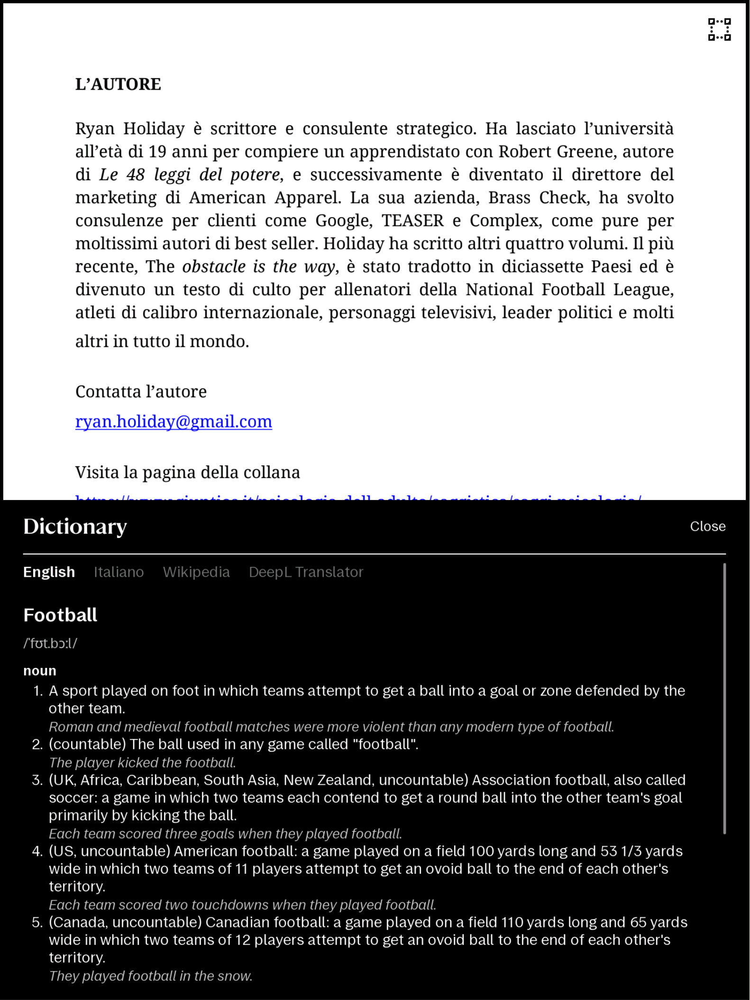
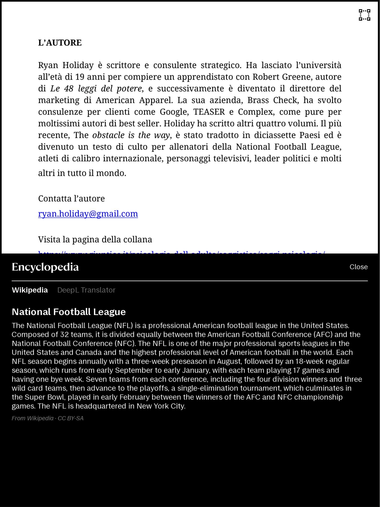
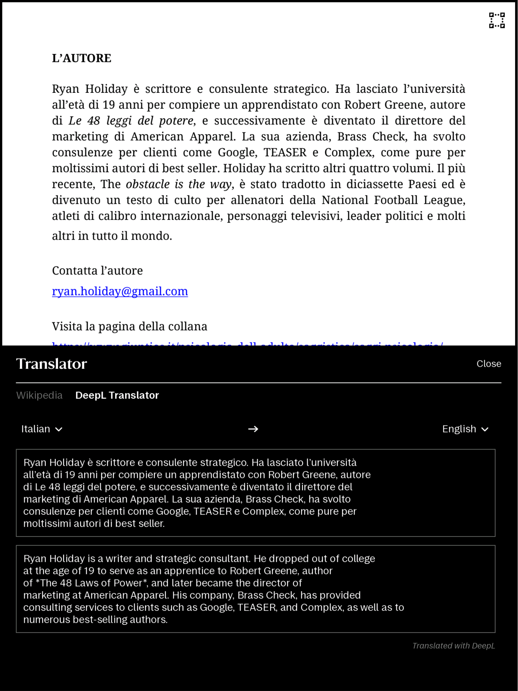
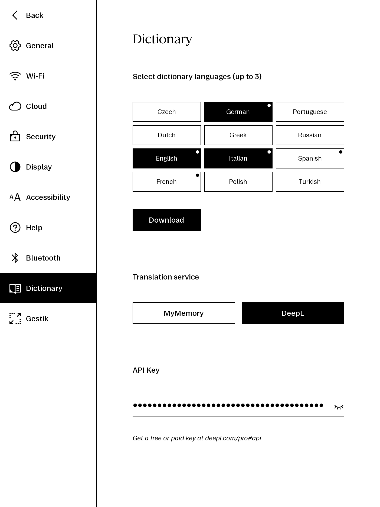

# XOVI Extensions for reMarkable

A personal suite of custom [XOVI](https://github.com/asivery/xovi) `.qmd` extensions to enhance the reMarkable tablet workflow, refining the user interface and unlocking essential missing features.

At its core: 
- **[Gestik](#gestik)** — three-, four-, five-finger gestures to instant switch writing tools / navigation to page overview / ToC and more without reaching for the toolbar. Configurable from: *Settings ▸ Gestik* page.
- **[LinkFromSelection](#linkfromselection)** — *links* from a selection: jump to a page in the same document or another one.
- **[NavHistory](#navhistory)** — *Back & Forward* navigation through your visited-page history.
- **Additional nine tweaks** — see the [extensions table](#available-extensions) below.

Tested only for the latest reMarkable OS *xochitl 3.27.2.2* (rM Paper Pure).

## Install

Requires a developer-mode reMarkable running [XOVI](https://github.com/asivery/xovi) and
[qt-resource-rebuilder](https://github.com/asivery/rm-xovi-extensions/tree/master/qt-resource-rebuilder). Every extension needs `qt-resource-rebuilder`; a few need other `XOVI` extensions.


### Vellum package manager (recommended)

Most extensions are available in [Vellum](https://vellum.delivery):

```sh
vellum add <extension-name>
``` 

### Manual

Download the `.qmd` files into `/home/root/xovi/exthome/qt-resource-rebuilder/` and restart `xochitl` over the USB connection:

```sh
scp extensionName.qmd root@10.11.99.1:/home/root/xovi/exthome/qt-resource-rebuilder/
ssh  root@10.11.99.1 'systemctl restart xochitl'
```

## Available Extensions

| Extension | Description |
| --- | --- |
| [**gestik.qmd**](#gestik) | Configurable **multi-finger gestures** from: **Settings ▸ Gestik** page |
| [**linkFromSelection.qmd**](#linkfromselection) | On-page **links** from a lasso selection: tap to jump to a page in the current document or to another document; long-press to edit/delete the link |
| [**navHistory.qmd**](#navhistory) | **Page Back & Forward navigation** through visited-page history, via quick-browse arrow buttons or 5-finger swipes |
| [**dictionaryWikiTranslator.qmd**](#dictionary) | Adds integrated dictionary, Wikipedia, and translation capabilities for PDFs and EPUBs. Configurable from: **Settings ▸ Dictionary**|
| [**visibleSleepScreen.qmd**](#visiblesleepscreen) | Sets visible content as sleep screen when "Visible content" is ON.|
| [**forceWideColumn.qmd**](#forcewidecolumn) | Forces every note's typed text to the **Wide column** on open, including existing notes |
| [**fasterPageLabels.qmd**](#fasterpagelabels) | Auto-hides the page-number label ~1.25 s after a page turn |
| [**fasterScrollBar.qmd**](#fasterscrollbar) | Auto-hides the document scrollbar ~0.35 s after you stop scrolling |
| [**hideBackToPageBar.qmd**](#hidebacktopagebar) | Suppresses the native "*Back to page N*" bar that pops up after you follow a PDF hyperlink |
| [**hideTitleQuickBrowse.qmd**](#hidetitlequickbrowse) | Removes the document-title bar shown at the top while the quick-browse page-slider is up |
| [**dockButtons.qmd**](#dockbuttons) | Adds **My Files** / **Favorites** / **Tags** / **Trash** shortcut buttons to the homepage dock |
| [**toolbarTool.qmd**](#toolbartool) | Turns the toolbar collapse/expand button into active tool|
| [**collapseToolbarOnOpen.qmd**](#collapsetoolbaronopen) | Opens every document with the toolbar collapsed |

---

### Gestik
[](https://vellum.delivery/#/package/gestik/)

A configurable multi-finger gesture bundle from a dedicated **Settings ▸ Gestik** page. Map any 3-, 4-, or 5-finger swipe to the tool or action you want.

|  |  |
|:---:|:---:|

| Action | What it does |
|---|---|
| **Pens** — Pencil, Ball Point, Fine Liner, Marker, Highlighter, Calligraphy, Shader, Paintbrush, Mechanical Pencil | Switches the tool and sets its thickness and colour |
| **Eraser** / **Erase Selection** | Swipe again to reactivate the previous pen |
| **Page Overview** | Opens the page overview |
| **Table of Contents** | Opens the ToC |
| **Search** | Opens search |
| **Show / Hide Template or PDF Background** | Toggles the template or PDF background |
| **Increase / Decrease Thickness** | Steps the current pen's thickness up or down by 0.5 |
| **Lasso** / **Selection** | Tap again to reactivate the previous pen |
| **Off** | Disables the gesture |

---

### LinkFromSelection
[](https://vellum.delivery/#/package/link-from-selection/)

Adds links on the page straight from a selection. Lasso some strokes, then tap one of the two buttons in the selection menu:

- **Same-document link** — tap a page from the native page overview / ToC and a clickable icon appears next to the selection. Tapping the icon jumps to that page.
- **Cross-document link** — from the file browser, select a document, then a page to link. Tapping the clickable icon created on the source page opens the
  other document at that page with a *Back* notification to return.

| Same-document link | Cross-document link|
|:---:|:---:|
|  |  |
|  |  |
| | |
| |  |

Links works in `PDF`, `Notebook` and `EPUB` files.

>[!Tip]
> Long-press the icon for an *edit / reposition / delete* menu (re-pick the target, reposition or remove the link). Links are stored *per document*, inside the document's own folder, so they're auto-deleted with it and survive restarts. If a target document or page no longer exists, tapping its icon offers to delete the dangling link.

|  |  |
|:---:|:---:|

>[!Important]
> A link is independent of the strokes you drew it from: **erasing that handwriting does not delete the link**. A link also can't be selected with lasso tool and dragged. If you need to reposition one, you can either long-press the icon and tap on the reposition button, move the original handwriting that generated it, or simply delete the link and create a new one in a new position.

---

### NavHistory
[](https://vellum.delivery/#/package/nav-history/)

Adds back & forward navigation through the pages visited (hyperlink/ToC jumps and page turns), like a desktop PDF viewer's `‹ ›`. Swipe up the quick-browse page-slider to reveal *Back / Forward* buttons. The same actions are also bound to a *5-finger swipe left / right*. Jumps track page identity, so they stay correct across page insert/delete/reorder. It adds also a back button to the previous opened document. 


|  |   |
|:---:|:---:|


|  |
|:--:|


---

### Dictionary
[](https://vellum.delivery/#/package/dictionary-wiki-translator/)

Adds integrated dictionary, Wikipedia, and translation capabilities for PDFs and EPUBs. By lassoing a word or phrase and tapping the book icon in the selection menu, a bottom panel opens with three tabs:
1. **Dictionary**: Offline (download up to 3 of 12 available languages via Settings)
2. **Encyclopedia**: Online (fetches summaries)
3. **Translator**: Online (*MyMemory* – works instantly without an API key and *DeepL* – requires to set an API key from [deepl.com/pro#api](https://www.deepl.com/pro#api))

The mod is customizable via the dedicated **Settings ▸ Dictionary** page. Here, you can download up to 3 of 12 available offline dictionary languages, select your preferred translation service (MyMemory / DeepL), and input your DeepL API key.

|  |
|:--:|

|  |   |
|:---:|:---:|

|  |   |
|:---:|:---:|

---

### VisibleSleepScreen
[](https://vellum.delivery/#/package/visible-sleep-screen/)

It sets visible content as sleep screen when "Visible content" (Settings ▸ Display ▸ "Visible content") is ON. It renders the stock screen when "Visible content" is OFF. 
  
|  |
|:--:|

### ForceWideColumn
[](https://vellum.delivery/#/package/force-wide-column/)

Whenever a note that has typed text is opened, its column is forced to *Wide*, including notes you created earlier. 

| Narrow / Medium column |  Wide column |
|:---:|:---:|
|  |   |

>[!IMPORTANT]
>It overwrites each note's saved Narrow/Medium width with Wide — a note you set to Narrow snaps back to and is re-saved as Wide on reopen. 

---

### FasterPageLabels
[](https://vellum.delivery/#/package/faster-page-labels/)

Shortens how long the page-number label (bottom of the screen) lingers after a page turn before it auto-hides (~1.25 s).

| Original speed |`fasterPageLabels.qmd` speed |
|:---:|:---:|
|  |   |

---

### FasterScrollBar
[](https://vellum.delivery/#/package/faster-scroll-bar/)

Shortens how long the scroll bar lingers after you lift your finger (fades in ~0.35 s).

| Original speed |`fasterScrollBar.qmd` speed |
|:---:|:---:|
|  |   |

---

### HideBackToPageBar
[](https://vellum.delivery/#/package/hide-back-to-page-bar/)

After you follow a PDF hyperlink, `xochitl` pops a *"Back to page N"* notification bar at the bottom of the screen. With [navHistory](#navHistory) already providing Back/Forward, that bar is redundant. this extension removes it entirely.

|  |
|:--:|

---

### HideTitleQuickBrowse
[](https://vellum.delivery/#/package/hide-title-quick-browse/)

Removes the document-title bar shown at the top of the screen while the
quick-browse page-slider is up (a one-finger swipe up from the bottom edge).

|  |
|:--:|

---

### DockButtons
[](https://vellum.delivery/#/package/dock-buttons/)

Adds four shortcut buttons to the homepage dock: *My Files*, *Favorites*, *Tags* and *Trash*, each jumping the file browser straight to that view in one tap. This extends the original [FouzR](https://github.com/FouzR)'s [`favTagButton.qmd`](https://github.com/FouzR/xovi-extensions/blob/main/3.27/favTagButton.qmd).

|  |
|:--:|

---

### ToolbarTool

Turns the toolbar expand button into an at-a-glance readout of the active tool. This is adapted from [FouzR](https://github.com/FouzR)'s [`toolbar_icon.qmd`](https://github.com/FouzR/xovi-extensions/blob/main/3.27/toolbar_icon.qmd); the changes are layout-only: two tuned values (`font.pointSize` 20→15, `leftPadding` 10→4) plus right-justifying the thickness number, all for half-step (X.5) thickness readability.

|`toolbar_icon.qmd` |`toolbarTool.qmd` |
|:---:|:---:|
|  |   |

---

### CollapseToolbarOnOpen
[](https://vellum.delivery/#/package/collapse-toolbar-on-open/)

Opens every document (notebook, PDF, typed-text) with the toolbar forced into its collapsed state for a distraction-free page. 

---

## Credits

Several mods of this repo builds on other people's work in the reMarkable / XOVI modding community:

- **[asivery](https://github.com/asivery)** 
- **[FouzR](https://github.com/FouzR)** 
- **[rmitchellscott](https://github.com/rmitchellscott)**

## License

This project is licensed under the GPL-3.0-only — see the [LICENSE](LICENSE) file for details.
